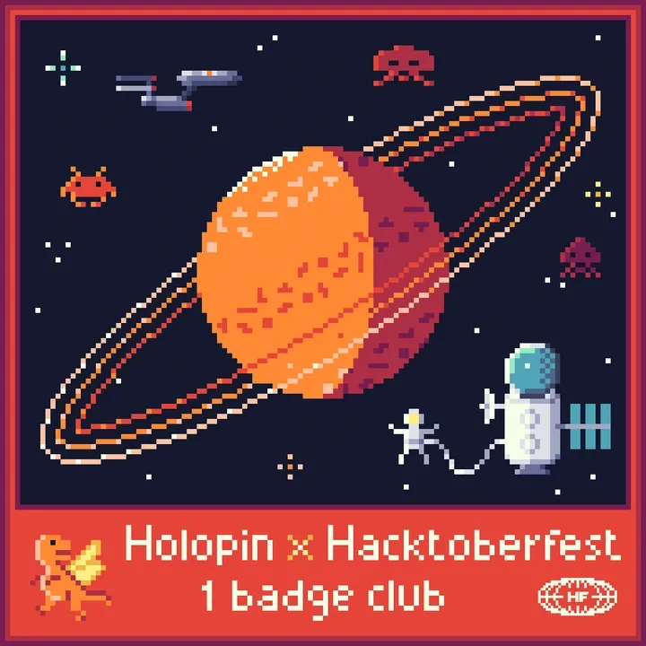

<h2></h2>

<h1 align="center" style="text-decoration: none; cursor: none;">Hello Guys👋 </h1>
          
### 👋 Hi, I'm Spandan Das

🎯 Passionate Software Developer | competitive coder | 💻 Student | 🌱 Currently learning *MERN Stack Web Development*

---

           
        

      <!-- Coding GIF -->
       

### 💫 About Me:
- 🌱 I’m currently learning MERN Stack Web Development  
- 👨‍💻 All of my projects are available are:
- All my created projects. Beginner 🔰 level projects. ✨
1. The link for my html,css project on calculator is https://procalculaor.netlify.app/
2. The link for my Tmsl survey form is https://tmslsurveyform.netlify.app/
3. The link for my project on clone website of GFG is https://geeksclone.netlify.app/
4. The link of my created weather website is https://weatherappspandan.netlify.app/
5. The link of my portfolio website(begginer level) https://spandanportfolio20251.netlify.app/
6. The link of my google clone website is https://googleclone-by-spandan.netlify.app/
7. The link of E com website is https://ecommercewesell.netlify.app/
8. The link of my counter website :https://counter-by-js.vercel.app/
9. The link of my created todo list : https://to-dolist-phi-lovat.vercel.app/

### Leetcode profile:
- https://share.google/PesnJOWs2LgbNlDdc
---

### LeetCode Stats

---  

### GeeksForGeeks profile:
- https://www.geeksforgeeks.org/user/spandan2024tmsl/
  
---

### GeeksForGeeks Stats

--- 

### CodeChef profile:
- https://www.codechef.com/users/span_dan_06
  
---

- 🧑‍🎓 Student | Learner | Code Enthusiast  
- 📫 How to reach me: sd672483@gmail.com
- 📫 How to reach me: dasspandan2106@gmail.com

---

### 🧰 Languages and Tools:

  
  
  
  
  
  
  

---

### 📊 GitHub Stats:

---
### 🔝 Top Contributed Repo

---
### Badges

  
  
  
  

### 🔗 Connect with Me:

<h3 align="center">📊 Stats of Obsession</h3>

  

